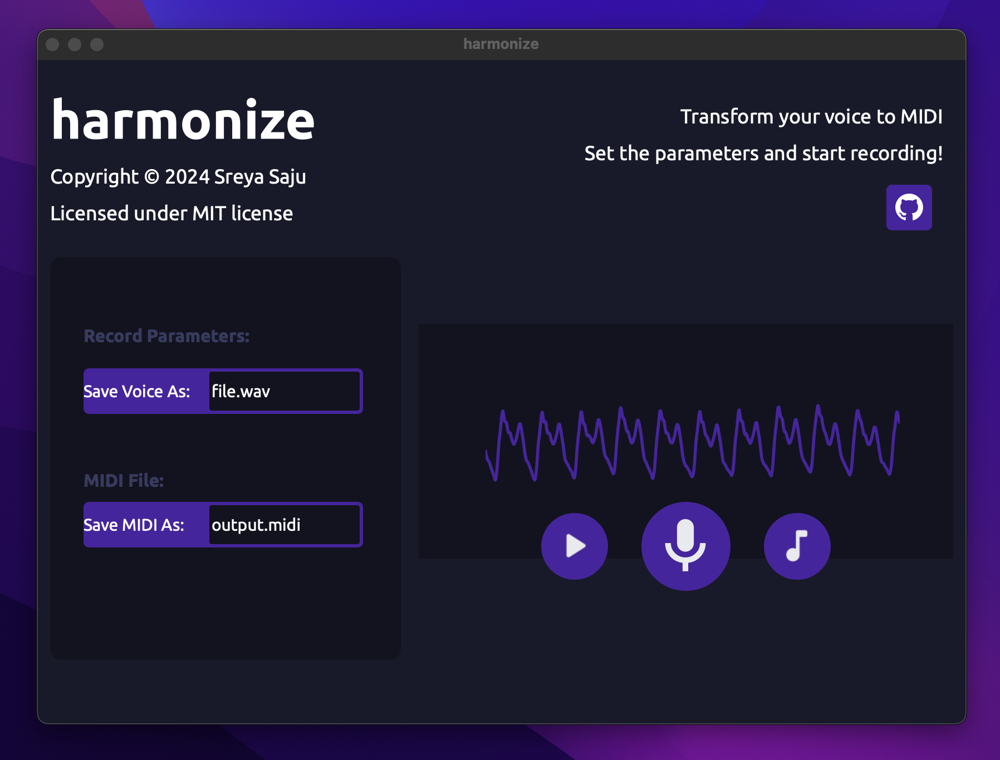

# harmonize



> Under development!

harmonize is a voice-to-MIDI python App to convert any human voice recording to MIDI tracks.
This uses `librosa` and `mido` for audio analysis and pitch detection, `PyAudio` for recording and `pydub` for playback tasks.
It is designed to minimally convert  vocal sounds into MIDI data for use in various musical applications.

## Features 
- Live Audio Recording 🎤: Capture vocal input directly through the application.
- Pitch Detection 🎵 : Analyze vocal pitch and convert it into MIDI notes.
- MIDI File Generation 🎹: Save the detected pitches as MIDI files.

## Installation:

Clone the repository:

```bash
git clone https://github.com/sreyasaju/harmonize.git
cd harmonize
```

Setup a Virtual Environment:
```bash
python3 -m venv venv
source venv/bin/activate  # On Windows use `venv\Scripts\activate`
```

Install dependencies:
```bash
pip install -r requirements.txt
```
Run the script: 
```bash
python3 main.py
```
## Usage 

1. Input the parameters: Enter the filename for saving the voice and the MIDI file 
2. Start Recording!
3. Play and hear your voice
4. Convert to MIDI
5. Listen the MIDI file in your favorite audio editor!

## Contributing
Contributions are welcome! Please submit a pull request or open an issue to discuss potential improvements.
Add do star the repo ⭐️


## License
```
MIT License

Copyright (c) 2024 Sreya Saju

Permission is hereby granted, free of charge, to any person obtaining a copy
of this software and associated documentation files (the "Software"), to deal
in the Software without restriction, including without limitation the rights
to use, copy, modify, merge, publish, distribute, sublicense, and/or sell
copies of the Software, and to permit persons to whom the Software is
furnished to do so, subject to the following conditions:

The above copyright notice and this permission notice shall be included in all
copies or substantial portions of the Software.

THE SOFTWARE IS PROVIDED "AS IS", WITHOUT WARRANTY OF ANY KIND, EXPRESS OR
IMPLIED, INCLUDING BUT NOT LIMITED TO THE WARRANTIES OF MERCHANTABILITY,
FITNESS FOR A PARTICULAR PURPOSE AND NONINFRINGEMENT. IN NO EVENT SHALL THE
AUTHORS OR COPYRIGHT HOLDERS BE LIABLE FOR ANY CLAIM, DAMAGES OR OTHER
LIABILITY, WHETHER IN AN ACTION OF CONTRACT, TORT OR OTHERWISE, ARISING FROM,
OUT OF OR IN CONNECTION WITH THE SOFTWARE OR THE USE OR OTHER DEALINGS IN THE
SOFTWARE.
```

<hr>
Copyright © 2024 Sreya Saju

