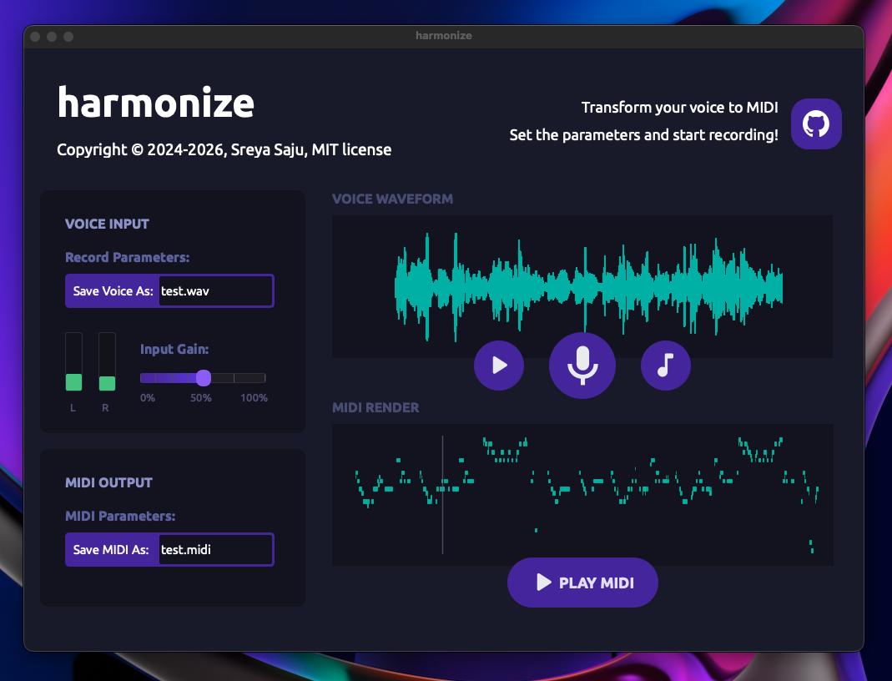

# harmonize



harmonize is a voice-to-MIDI desktop application built in Python. Hum or sing into your microphone and it converts your voice into a MIDI file you can open in any DAW.

## Features

- **Live Waveform Recording** — capture vocal input with real-time L/R gain visualization and scrolling waveform display
- **Pitch Detection** — converts vocal audio to MIDI notes using librosa's pYIN algorithm (probabilistic YIN), covering the C2–C7 vocal range
- **Piano Roll Visualization 🎹** — renders detected notes as a scrolling piano roll with a synchronized playhead
- **MIDI Playback** — plays back the converted MIDI inside the app via FluidSynth rendering and sounddevice streaming, with pause/resume support
- **MIDI File Export** — saves the detected pitches as a standard `.midi` file for use in GarageBand, Ableton, or any DAW

## How It Works

1. **Record** — PyAudio captures your voice at 44100 Hz, 16-bit mono. The waveform scrolls live as you sing.
2. **Convert** — librosa loads the WAV, computes RMS energy per frame, and runs `librosa.pyin` to extract fundamental frequency estimates and voiced/unvoiced flags frame by frame. A 3-frame stability window filters out pitch estimation noise before committing to a MIDI note. mido writes the output as a standard MIDI file.
3. **Visualize** — the detected notes are rendered as a matplotlib piano roll embedded in the Qt window.
4. **Play** — FluidSynth renders the MIDI to a WAV using a bundled SoundFont, then sounddevice streams it back with real pause/resume.

## Dependencies

| Library | Purpose |
|---|---|
| `librosa` | Audio loading, RMS energy, pYIN pitch detection |
| `mido` | MIDI file construction and export |
| `PyAudio` | Live microphone capture |
| `PySide6` | Desktop GUI and Qt event loop |
| `matplotlib` | Waveform and piano roll rendering (QtAgg backend) |
| `sounddevice` + `soundfile` | MIDI audio playback with pause/resume |
| `FluidSynth` | MIDI-to-WAV rendering via SoundFont |
| `numpy` | Audio buffer management and array operations |
| `numba` | JIT compilation used internally by librosa |

> **Note:** FluidSynth must be installed separately on your system (`brew install fluidsynth` on macOS, `apt install fluidsynth` on Linux).

## Installation

Clone the repository:
```bash
git clone https://github.com/sreyasaju/harmonize.git
cd harmonize
```

Set up a virtual environment:
```bash
python3 -m venv venv
source venv/bin/activate  # On Windows: venv\Scripts\activate
```

Install dependencies:
```bash
pip install -r requirements.txt
```

Run:
```bash
python3 main.py
```

## Usage

1. Enter a filename for your voice recording and MIDI output
2. Hit **Record** and sing or hum your melody
3. Hit **Record** again to stop — the waveform will have scrolled live as you recorded
4. Hit **Convert** — a loading animation plays while pitch detection runs
5. The piano roll renders your notes when conversion is done
6. Hit **Play MIDI** to hear it back inside the app, or open the `.midi` file in your DAW

## Known Limitations

- Pitch detection works best on clean, sustained monophonic vocal input — noisy environments or rapid note changes will produce jitter
- Polyphonic input (chords, harmonics) is not supported; only the fundamental frequency is tracked
- FluidSynth must be installed separately and available on your system `PATH`

## Contributing

Contributions are welcome. Please submit a pull request or open an issue to discuss potential improvements. Add do star the repo ⭐️

## License
```
MIT License

Copyright (c) 2024-2026 Sreya Saju

Permission is hereby granted, free of charge, to any person obtaining a copy
of this software and associated documentation files (the "Software"), to deal
in the Software without restriction, including without limitation the rights
to use, copy, modify, merge, publish, distribute, sublicense, and/or sell
copies of the Software, and to permit persons to whom the Software is
furnished to do so, subject to the following conditions:

The above copyright notice and this permission notice shall be included in all
copies or substantial portions of the Software.

THE SOFTWARE IS PROVIDED "AS IS", WITHOUT WARRANTY OF ANY KIND, EXPRESS OR
IMPLIED, INCLUDING BUT NOT LIMITED TO THE WARRANTIES OF MERCHANTABILITY,
FITNESS FOR A PARTICULAR PURPOSE AND NONINFRINGEMENT. IN NO EVENT SHALL THE
AUTHORS OR COPYRIGHT HOLDERS BE LIABLE FOR ANY CLAIM, DAMAGES OR OTHER
LIABILITY, WHETHER IN AN ACTION OF CONTRACT, TORT OR OTHERWISE, ARISING FROM,
OUT OF OR IN CONNECTION WITH THE SOFTWARE OR THE USE OR OTHER DEALINGS IN THE
SOFTWARE.
```

<hr>
Copyright © 2024-2026 Sreya Saju

